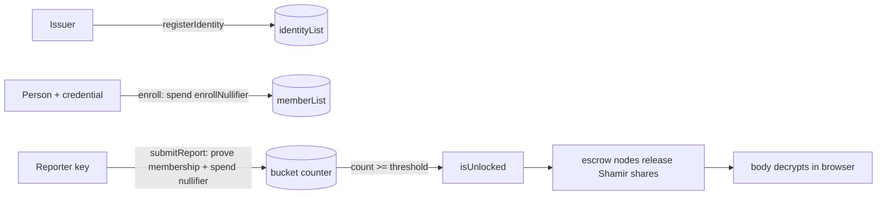

# Quorum

**Anonymous allegation escrow on [Midnight](https://midnight.network).** A report
against a person stays sealed until `threshold` *independent* reporters
name the same person — then, and only then, the bodies unlock. Every reporter is
anonymous; "independent" is enforced in zero knowledge, not by trust.

> Built for a hackathon. Read [`SECURITY.md`](./SECURITY.md) for the exact line
> between what is cryptographically enforced and what is still trusted.

## The problem

Corroboration systems ("I'm not the only one") die to Sybil attacks: one person
spins up many identities and manufactures a fake quorum. Quorum makes "N
reporters" mean "N distinct issued identities" — while revealing nothing about
who any reporter is, or which report is whose.

## How independence is enforced

Three layers, all in zero knowledge, in [`contracts/quorum.compact`](./contracts/quorum.compact):

| Layer | Circuit | Guarantee |
| --- | --- | --- |
| **A · Nullifier** | `submitReport` | `nullifier = hash(reporterSecret, accusedID)`, single-use → one reporter key files against one person **at most once**. |
| **B · Membership** | `submitReport` | proves the caller's reporter key is a leaf of `memberList` **without revealing which leaf**. An un-enrolled key cannot file. |
| **C · Identity-bound enrollment** | `enroll` | a key enters `memberList` only by spending a one-time identity credential (a leaf of `identityList`, published by an issuer) plus a per-identity `enrollNullifier`. One issued identity → one enrolled key. |

Residual trust: the issuer registering one credential per real person. That is
the irreducible core of Sybil resistance; everything downstream of it is
cryptographic here.



## Quick start (local devnet)

Requirements: Node 22, Docker with Compose v2, the Compact compiler (`0.31.1` —
see [`docs/MIDNIGHT.md`](./docs/MIDNIGHT.md)).

```bash
npm install
npm run setup       # docker compose up -d --wait · compile · deploy
npm run test:e2e    # reconnect + read back ledger state
```

Full zero-knowledge property test (deploy · enroll · Sybil attempts · quorum ·
unlock — ~5 min, needs the devnet up):

```bash
npm run quorum:e2e
```

## Run the web app

```bash
npm run quorum:api             # :8787 — boots wallet, deploys, seeds the issuer
                               #         pool, spawns 3 escrow nodes. First boot ~2–3 min.
cd ui && npx vite --host       # :5173
```

Then open <http://localhost:5173>:

1. **Claim a reporter slot** — spend a credential (`citizen-1…3`) to enrol a
   passphrase-derived reporter key. Do it twice (two credentials).
2. **File** against the same person with each key to cross the threshold. The
   body is AES-GCM sealed in the browser and its key Shamir-split to the escrow
   nodes.
3. **Reveal** — before quorum every escrow node withholds its share; after, any
   2 of 3 reconstruct and the body decrypts locally.

Configuration is via environment variables — see [`.env.example`](./.env.example).
`NODE_ENV=production` makes [`server/config.ts`](./server/config.ts) fail closed
(no built-in secrets, no `*` CORS, bearer token required).

## Credential issuance

Two ways a reporter key gets enrolled:

- **Seeded pool** (dev/demo) — `QUORUM_IDENTITY_POOL=citizen-1,citizen-2,citizen-3`.
  The issuer registers these on boot; anyone can spend one. Set the var empty to
  disable.
- **Email allowlist** — the issuer verifies people out of band and lists their
  emails (`QUORUM_ALLOWLIST=…`, or `server/.allowlist.json`). A person requests a
  credential (`/api/request-credential`), gets a single-use claim link
  (`<ui>/?claim=<token>`; printed to the API console until `QUORUM_SMTP_URL` +
  `npm i nodemailer`), picks a reporter key, and the server mints a random
  32-byte credential and spends it to enrol — one per email, ever. The server
  keeps no email → reporter-key link. `/api/request-credential` returns the same
  response whether or not the address is on the list.

## Production checklist

Done: fail-closed config, per-IP rate limiting, security headers, input/size
caps, atomic store writes, CI (typecheck + UI lint/build), email-allowlist
credential issuance (random per-person secrets, single-use claim links).

Still needed:

- [ ] Real signing wallet (Lace) instead of the devnet genesis seed
- [ ] Deployment to a funded network (`preview` / `preprod`)
- [ ] A database instead of `server/*.json` flat files
- [ ] Capability tokens for the escrow nodes' `/store`
- [ ] Full e2e in CI against an ephemeral devnet
- [ ] Rotate/scope the issuer secret; move it out of the app process

## Repo layout

```
contracts/quorum.compact   the zero-knowledge contract (4 circuits)
server/index.ts            demo API — bridges the browser to the contract
server/escrow-node.ts      one of k independent Shamir-share holders
server/config.ts           env config; fail-closed when NODE_ENV=production
server/http.ts             zero-dep CORS allow-list, headers, rate limit, atomic write
ui/                        Vite + React client (seal, split, file, reveal)
src/                       wallet / network / deploy scaffolding (create-mn-app)
scripts/quorum-e2e.ts      full property test
docs/MIDNIGHT.md           networks, wallets, faucet, toolchain
NOTES.md                   build log & gotchas
```

## License

MIT
