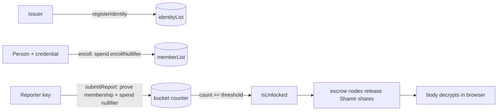

# Quorum

**Anonymous allegation escrow on [Midnight](https://midnight.network).** A report
against a person stays sealed until `threshold` *independent* reporters name the
same person — then, and only then, the bodies unlock. Every reporter is
anonymous; "independent" is enforced in zero knowledge, not by trust.

> Built for a hackathon. [`SECURITY.md`](./SECURITY.md) draws the exact line
> between what is cryptographically enforced and what is still trusted.
> [`docs/STORY.md`](./docs/STORY.md) / [`docs/DEVPOST.md`](./docs/DEVPOST.md) are
> the long-form write-ups.

---

## The problem

Corroboration systems ("I'm not the only one") die to Sybil attacks: one person
spins up many identities and manufactures a fake quorum — or the accused does it
to bury a real one. Quorum makes "N reporters" mean **"N distinct issued
identities"**, while revealing nothing about who any reporter is, or which report
is whose.

Below threshold, Quorum is a sealed vault. At threshold, it's a filing cabinet
that was already full.

## How independence is enforced

Four circuits in [`contracts/quorum.compact`](./contracts/quorum.compact), over a
ledger of two `HistoricMerkleTree<10>`s, two nullifier `Set`s, a
`Map<Bytes<32>, Uint<64>>` bucket counter, a `threshold`, and an
`issuerCommitment`:

| Layer | Circuit | Guarantee |
| --- | --- | --- |
| **A · Nullifier** | `submitReport` | `nullifier = H("…:nullifier:v1", reporterSecret, accusedID)`, single-use → one reporter key files against one person **at most once**. One-way, so it links to neither. |
| **B · Membership** | `submitReport` | proves the caller's reporter key is a leaf of `memberList` **without revealing which leaf**. An un-enrolled key produces no valid proof. |
| **C · Identity-bound enrollment** | `enroll` | a key enters `memberList` only by spending a one-time identity credential (a leaf of `identityList`, published by the issuer) **plus** a per-identity `enrollNullifier`. One issued identity → one enrolled key. |
| **D · Issuer gate** | `registerIdentity` | only a caller who reproduces `issuerCommitment = H("…:issuer:v1", issuerSecret)` can add identity leaves. |
| **Escrow** | off-chain | the body key is AES-256-GCM in the browser, then Shamir-split *t*-of-*k* (default 2-of-3) across independent nodes. Each node re-checks the chain itself and releases its share only once `buckets[bucketKey] ≥ threshold`. |

**Residual trust:** the issuer registering one credential per real person — plus,
in this demo, the signing wallet and the fact that we run the escrow nodes.



---

## Quick start (local devnet)

**Requirements:** Node 22, Docker with Compose v2, the Compact compiler
(`0.31.1` — see [`docs/MIDNIGHT.md`](./docs/MIDNIGHT.md)).

```bash
npm install
npm run setup        # docker compose up -d --wait · compile · deploy
npm run test:e2e     # reconnect + read back ledger state
```

Full zero-knowledge property test (deploy · enroll · Sybil attempts · quorum ·
unlock — ~5 min, needs the devnet up):

```bash
npm run quorum:e2e
```

## Run the web app

```bash
npm run quorum:api            # :8787 — boots wallet, deploys/rejoins, seeds the
                              #         issuer pool, spawns 3 escrow nodes.
                              #         First boot ~2–3 min.
npm run quorum:ui             # :5173 — Vite dev server
```

or the detached launchers:

```bash
./run-api.sh                  # API + escrow nodes, backgroundable
./run-ui.sh                   # Vite on :5173, --strictPort --host
```

Then open <http://localhost:5173>:

1. **Claim a reporter slot** — spend a credential to enrol a passphrase-derived
   reporter key. Do it with as many distinct credentials as your `threshold`.
2. **File** against the same person with each key to cross the threshold. The
   body is AES-GCM sealed in the browser and its key Shamir-split to the escrow
   nodes.
3. **Reveal** — before quorum every escrow node withholds its share; after, any
   2 of 3 reconstruct and the body decrypts locally.

### Services & ports

| Service | Port | Source |
| --- | --- | --- |
| UI (Vite) | `5173` | [`ui/`](./ui) |
| Demo API | `8787` | [`server/index.ts`](./server/index.ts) |
| Escrow nodes ×3 | `8801`–`8803` | [`server/escrow-node.ts`](./server/escrow-node.ts) |
| Midnight node (RPC) | `9944` | `docker-compose.yml` |
| Indexer (GraphQL) | `8088` | `docker-compose.yml` |
| Proof server | `6300` | `docker-compose.yml` |

### Screenshots

<!-- Drop the images into docs/screenshots/ with these exact filenames. -->

| | |
| --- | --- |
| **1 · Claim a reporter credential** — verify email, pick a passphrase, credential minted + spent on chain |  |
| **2 · File a report** — body sealed in the browser; the "what actually leaves your device" panel shows the proof, bucket hash, nullifier, `+1` |  |
| **3 · Escrow board — sealed** — a bucket below threshold; every share withheld |  |
| **4 · Escrow board — unlocked** — threshold reached, 2-of-3 shares collected, bodies decrypted locally |  |

---

## API reference

Base URL `http://localhost:8787`. Mutating routes are per-IP rate-limited and, in
production, require `Authorization: Bearer <QUORUM_API_TOKEN>`.

| Method & path | Body | Purpose |
| --- | --- | --- |
| `GET /api/health` | — | liveness + boot phase + counts |
| `GET /api/state` | — | threshold, identities, members, nullifiers, buckets + reports |
| `POST /api/enroll` | `{ credentialId, reporterKey }` | seeded-pool path: spend a `citizen-*` credential to enrol a reporter key |
| `POST /api/request-credential` | `{ email }` | email-allowlist path: mint a single-use claim link (`<ui>/?claim=<token>`). Emailed if `QUORUM_SMTP_URL` is set, else printed to the API console. `403 NOT_ALLOWED` if the address isn't allowlisted. |
| `POST /api/claim-credential` | `{ token, reporterKey }` | redeem a claim link: mint a random 32-byte credential and spend it to enrol `reporterKey` |
| `POST /api/report` | `{ accusedLabel, reporterSecret, ciphertext, iv }` | file a report (proves membership + runs `submitReport`). `ciphertext`/`iv` are base64; the API never decrypts them. |
| `POST /api/reveal` | `{ bucketKeyHex }` | for an unlocked bucket, return the sealed bodies + escrow node list; the browser fetches Shamir shares and decrypts. `403 SEALED` below threshold. |

---

## Credential issuance

Two ways a reporter key gets enrolled:

- **Seeded pool** (dev/demo) — `QUORUM_IDENTITY_POOL=citizen-1,citizen-2,citizen-3`.
  The issuer registers these on boot; anyone can spend one via `POST /api/enroll`.
  Set the var empty to disable (e.g. to rejoin an existing contract without
  re-registering).
- **Email allowlist** — the issuer verifies people out of band and lists their
  emails (`QUORUM_ALLOWLIST=…`, or `server/.allowlist.json`). A person calls
  `POST /api/request-credential`, gets a single-use claim link, picks a reporter
  key, and `POST /api/claim-credential` mints a random 32-byte credential and
  spends it to enrol — **one per email, ever**. The server keeps no
  email → reporter-key link. The endpoint reports allowlist membership (`403` if
  absent), so the list is enumerable — an accepted trade for a closed,
  operator-run issuer.

---

## Configuration

Everything is environment variables — full list and defaults in
[`.env.example`](./.env.example). `NODE_ENV=production` makes
[`server/config.ts`](./server/config.ts) **fail closed**: no built-in secrets, no
`*` CORS, bearer token required.

| Variable | Default | Notes |
| --- | --- | --- |
| `QUORUM_API_PORT` | `8787` | |
| `QUORUM_THRESHOLD` | `2` | baked into the contract at deploy; changing it forces a redeploy |
| `QUORUM_ISSUER_SECRET` | dev default | drives `issuerCommitment`; **required in prod** |
| `QUORUM_PRIVATE_STATE_PASSWORD` | dev default | encrypts the LevelDB private-state store; **required in prod** |
| `QUORUM_IDENTITY_POOL` | `citizen-1,citizen-2,citizen-3` | empty = no seeded pool |
| `QUORUM_API_TOKEN` | unset (open) | bearer token for mutating routes; **required in prod** |
| `QUORUM_CORS_ORIGIN` | `*` | comma-separated origins; `*` rejected in prod |
| `QUORUM_RATELIMIT_WINDOW_MS` / `QUORUM_RATELIMIT_MAX` | `60000` / `20` | per-IP fixed window on mutating routes |
| `QUORUM_ALLOWLIST` / `QUORUM_ALLOWLIST_FILE` | — | allowlisted emails, or a JSON file the issuer maintains |
| `QUORUM_UI_BASE_URL` | `http://localhost:5173` | claim links are `<base>/?claim=<token>` |
| `QUORUM_MAGIC_TTL_MS` | `1800000` | claim-link lifetime (30 min) |
| `QUORUM_EMAIL_FROM` / `QUORUM_SMTP_URL` | — | unset SMTP → claim link printed to console (dev only); **URL required in prod** |
| `QUORUM_ESCROW_COUNT` / `QUORUM_ESCROW_THRESHOLD` / `QUORUM_ESCROW_BASE_PORT` | `3` / `2` / `8801` | |
| `QUORUM_SPAWN_ESCROW` | `1` | `0` = don't spawn escrow nodes from the API process |
| `MIDNIGHT_INDEXER_URL` / `…_WS_URL` / `…_NODE_URL` / `…_PROOF_SERVER_URL` / `…_FAUCET_URL` | per-network | override the resolved network endpoints |
| `VITE_QUORUM_API` | `http://localhost:8787` | UI → API base (build-time, `VITE_`-prefixed) |

---

## Troubleshooting

**API stuck at `"phase":"syncing-wallet"` forever.** Usually a stale wallet /
private-state cache pointing at a devnet chain that no longer exists (e.g. after
`docker compose down -v`). Clear it and restart:

```bash
rm -rf .midnight-wallet-state midnight-level-db server/.deployment.json
# or: npm run clean   (also removes contracts/managed and .midnight-state.json)
```

**Devnet node exits after long uptime** (`Essential task 'txpool-background'
failed`). The local chain DB has drifted; wipe and start fresh:

```bash
docker compose down -v && docker compose up -d --wait
```

**`Not enough Dust` right after deploy.** Transient — registered NIGHT takes a few
seconds to start generating DUST. Every tx is wrapped in a retry (10 × 5s); just
wait.

**UI shows "Too many requests — slow down".** The per-IP rate limiter
(`QUORUM_RATELIMIT_MAX`, default 20/min) tripped. Raise it for local demo work:
`export QUORUM_RATELIMIT_MAX=100000` before starting the API.

**`node: command not found` in scripts.** nvm-managed Node isn't on `PATH` for
non-interactive shells — run from a login shell or ensure Node 22 is on `PATH`.

---

## Production checklist

**Done:** fail-closed config, per-IP rate limiting, security headers, input/size
caps, atomic store writes, CI (typecheck + UI lint/build), email-allowlist
credential issuance (random per-person secrets, single-use claim links).

**Still needed:**

- [ ] Real signing wallet (Lace) instead of the devnet genesis seed
- [ ] Deployment to a funded network (`preview` / `preprod`)
- [ ] A database instead of `server/*.json` flat files
- [ ] Capability tokens for the escrow nodes' `/store`
- [ ] Full e2e in CI against an ephemeral devnet
- [ ] Rotate/scope the issuer secret; move it out of the app process

---

## Repo layout

```
contracts/quorum.compact   the zero-knowledge contract (4 circuits)
server/index.ts            demo API — bridges the browser to the contract
server/escrow-node.ts      one of k independent Shamir-share holders
server/config.ts           env config; fail-closed when NODE_ENV=production
server/http.ts             zero-dep CORS allow-list, headers, rate limit, atomic write
server/credentials.ts      allowlist + claim-token + issued-record stores
server/mailer.ts           claim-link transport (SMTP or console)
ui/                        Vite + React client (seal, split, file, reveal)
src/                       wallet / network / deploy scaffolding (create-mn-app)
scripts/quorum-e2e.ts      full property test
run-api.sh / run-ui.sh     detached local launchers
docs/MIDNIGHT.md           networks, wallets, faucet, toolchain
docs/STORY.md              long-form write-up
NOTES.md                   build log & gotchas
```

## License

MIT
